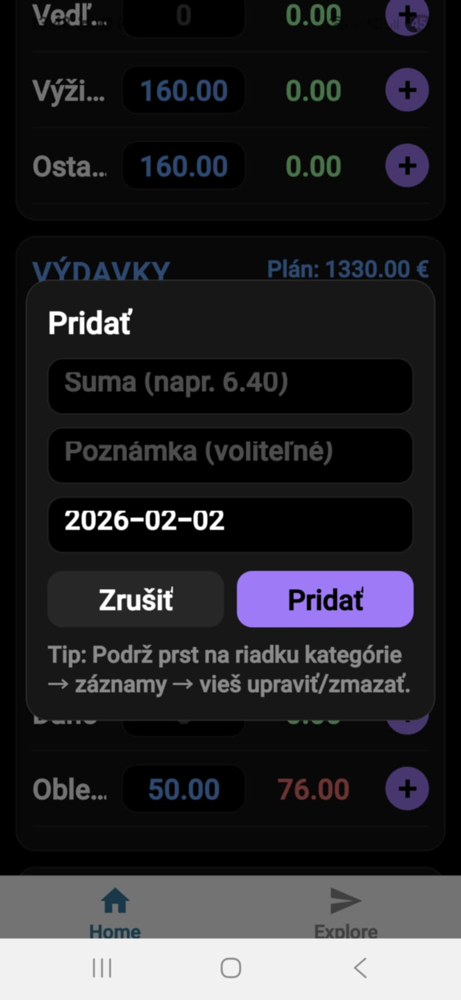
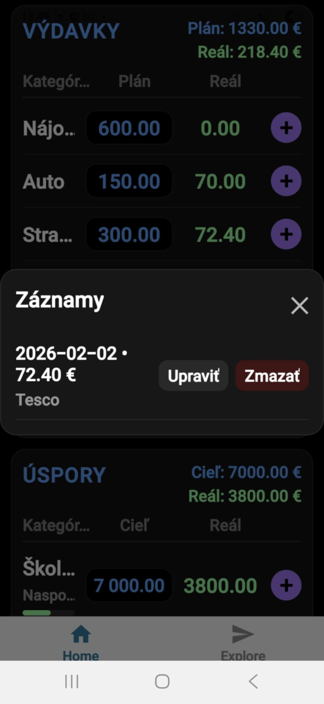
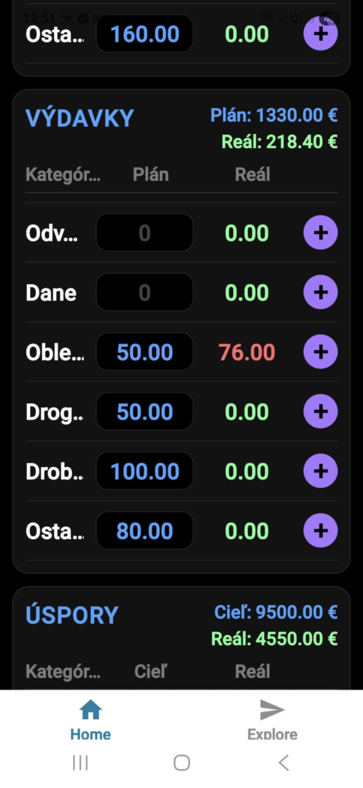

# Family Budget App

This project is a simple mobile budget tracking application developed as a learning project using Expo and React Native.

The main goal was not to build a production-ready application, but to understand the mobile app development process, including:
- defining a clear problem and goal,
- breaking the solution into logical steps,
- working with project structure and core components,
- and iteratively improving functionality.

The project was developed using a learning-by-doing approach.  
AI tools were used as supportive resources, similar to documentation or tutorials, to help explore approaches and clarify concepts, while all implementation decisions were made based on understanding the application’s goals and logic.

This project represents an early-stage learning experience and a growing interest in mobile development, problem-solving, and modern development tools.  
It serves as a practical foundation that will be further developed through formal study.

## Possible Future Extensions

Possible future extensions may include:
- data export functionality (e.g. Excel / CSV),
- basic visualisation of budget data (charts),
- extended reporting features.

These extensions represent potential directions for continued learning and development.

## Screenshots

### Monthly Summary

### Add Transaction

### Edit / Delete Transaction

### Budget Warning

### Goal Progress

